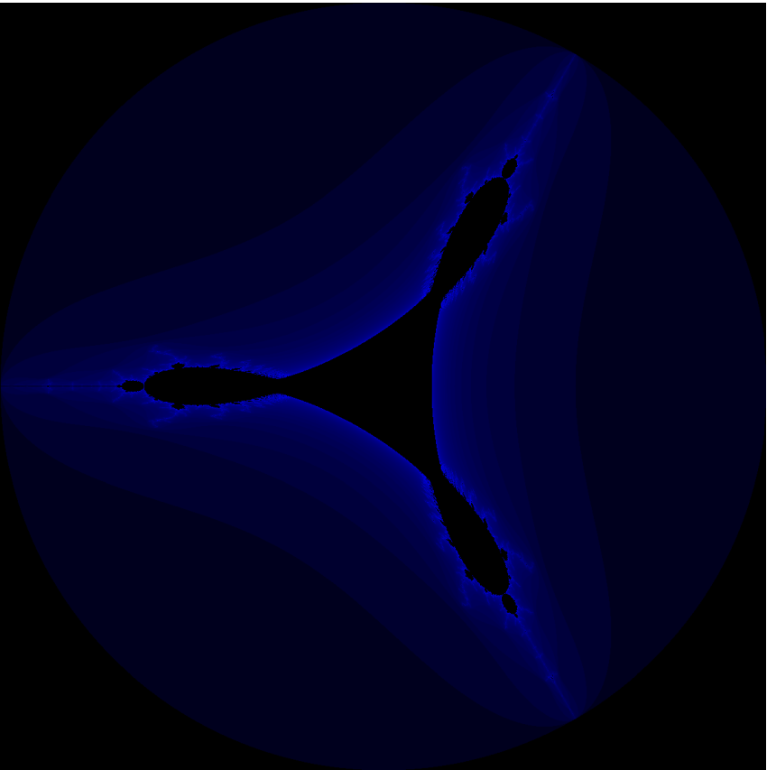
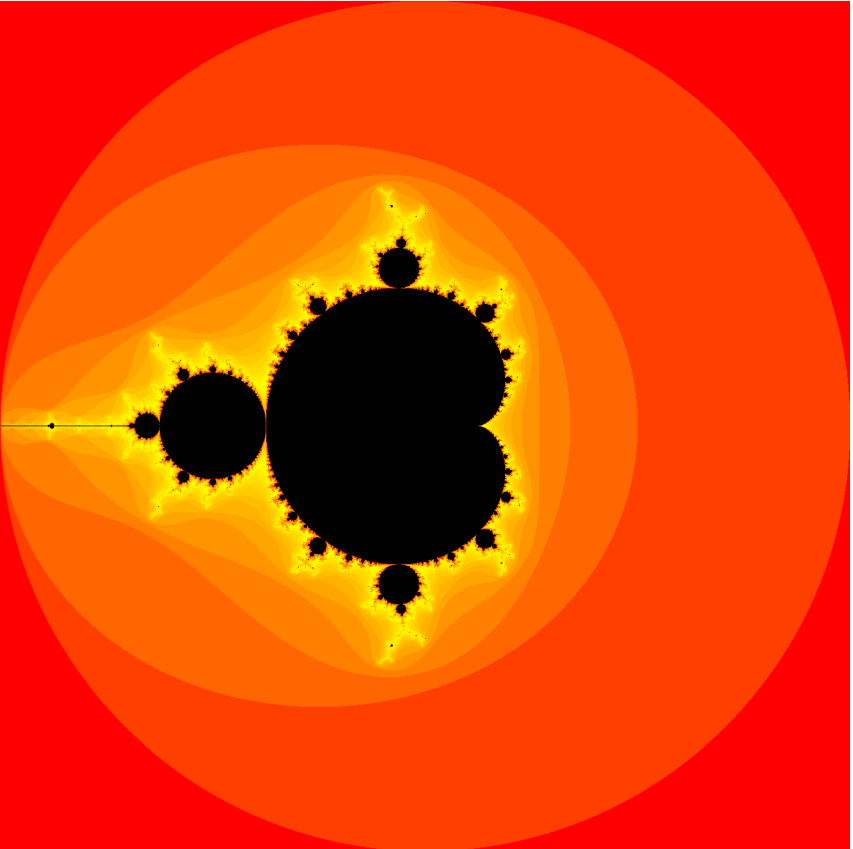
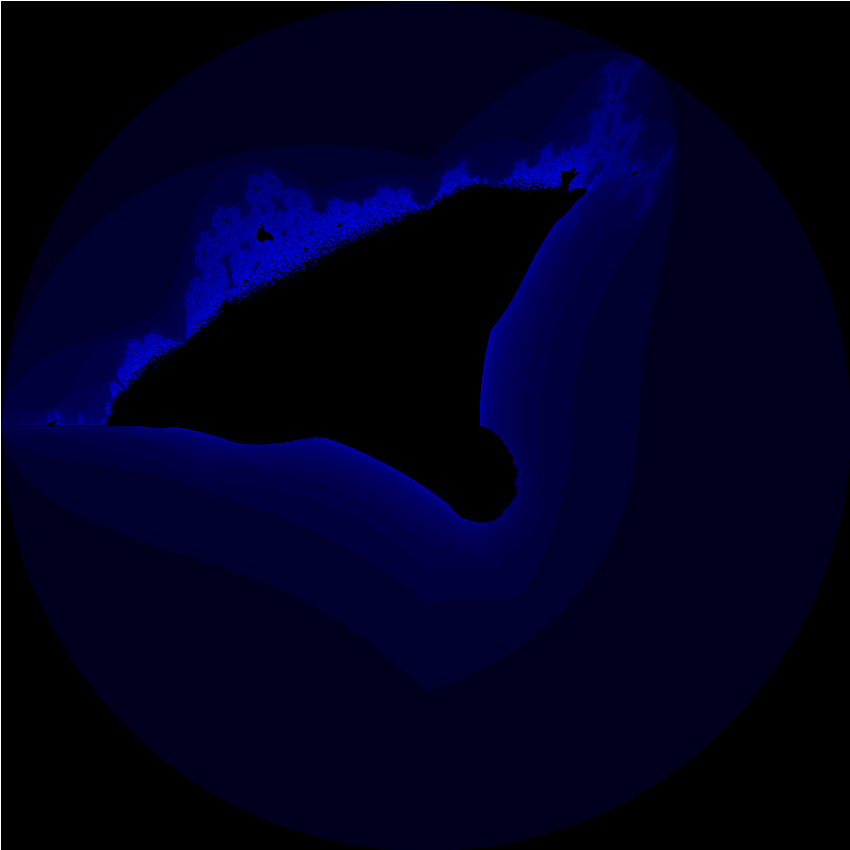

# About

This is a small program that's still a work in progress. It outputs a fractal with the image in the ppm format. There are websites that cobvert ppm to more common formats like png, or you can use IrfanView to view it directly. 

## Some fractals produced by the program 

### The Tricorn Fractal

### The Mandlebrot Set 

### The Burning Ship Fractal

